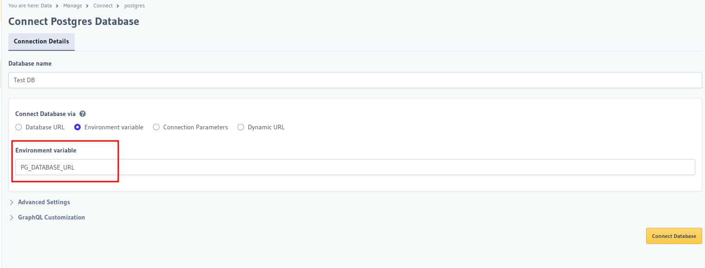

# Dev Env Setup

## Install the following
* [Docker Open Source](https://www.simplilearn.com/tutorials/docker-tutorial/how-to-install-docker-on-ubuntu)  
* [Hasura Cli](https://hasura.io/docs/latest/hasura-cli/install-hasura-cli/)   
* [Azure Cli](https://learn.microsoft.com/en-us/cli/azure/)   
* [Azure Functions Core Tools](https://learn.microsoft.com/en-us/azure/azure-functions/functions-run-local)  
* Other requirements like git, node  

## Setup Hasura
Get the docker compose file from [this link](https://hasura.io/docs/latest/getting-started/docker-simple/). 

### Get metadata initial backup
Initialize the backup folder (give a name like, hasura-metadata)  
```
hasura init 
```
In the folder that gets created edit the *config.yaml* file and remove the keys **endpoint** as well as **actions.handler_webhook_baseurl** we will provide these from .env file


### Variable Extraction
> [!NOTE]  
> The location of the .env file should be inside the metadata backup folder(for example inside hasura-metadata). This would enable hasura to use the same variables
  
In the compose file change extract necessary variables into .env file. Any variable that might be different in Dev environment and production environment should be extracted   
  
You can also set **HASURA_GRAPHQL_ENABLE_CONSOLE: "false"**   
  
> [!TIP]
> Variables like Action urls, Remote schema urls, Event urls should be extracted  
  
## Running the Project
Run the docker compose file
```
docker compose up -d
```
> [!NOTE]  
> you won't be able to access the console at port 8080. Since we set **HASURA_GRAPHQL_ENABLE_CONSOLE: "false"**  

```
cd hasura-metadata
hasura console --console-port 9500
```
Now you can access the console at *http://localhost:9500/*

## Connecting to DB


## Reference
* [Cli config environment variables](https://hasura.io/docs/latest/hasura-cli/config-reference/#environment-variables)  
