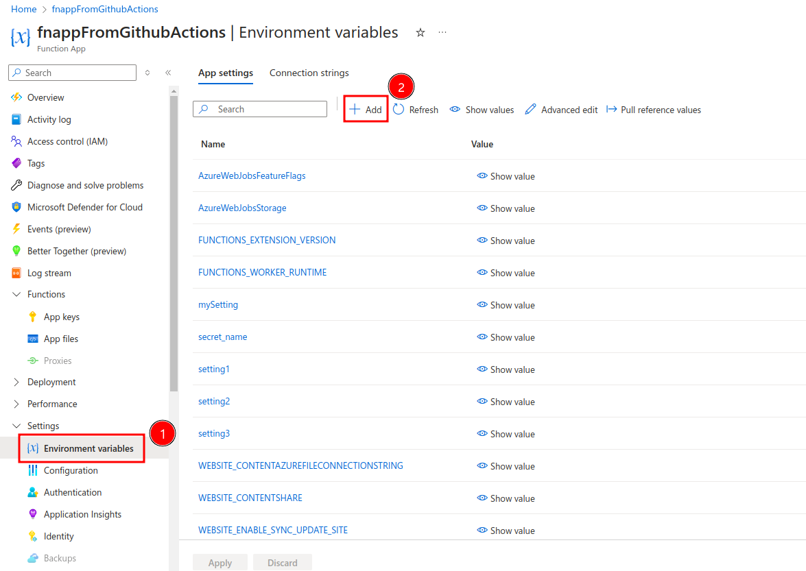

# Functions Environment Vars

## Local development
Use the **local.settings.json** file
```
{
  "IsEncrypted": false,
  "Values": {
    "AzureWebJobsStorage": "",
    "FUNCTIONS_WORKER_RUNTIME": "node",
    "CUSTOM_ENV_VAR_1": "hello",
    "CUSTOM_ENV_VAR_2": "world"
  }
}
```

To access the variable in your code 
```
process.env["CUSTOM_ENV_VAR_1"]
```

## Deploying to Azure Functions
There are multiple ways to add the env variables to azure

### use the azure cli
I will be using this method to push the env vars

Create a github secret **AZURE_FUNCTION_APP_PRODUCTION_ENV** with the env files as json data ie., key value pairs


```
az functionapp config appsettings set --name <function app name> --resource-group <resource group name> --settings @settings-update.json
```
here **settings-update.json** is a json with key value pairs and does not follow the schema of **local.settings.json**

### use the azure function cli
> [!CAUTION]
> This overwrites all values with the ones in **local.settings.json** the risk is that some values will be set by the bicep template those values (ex.,AzureWebJobsStorage) could also be overwritten

```
func azure functionapp publish <function app name> --publish-settings-only --overwrite-settings -y
```

### Manually adding through Azure portal


